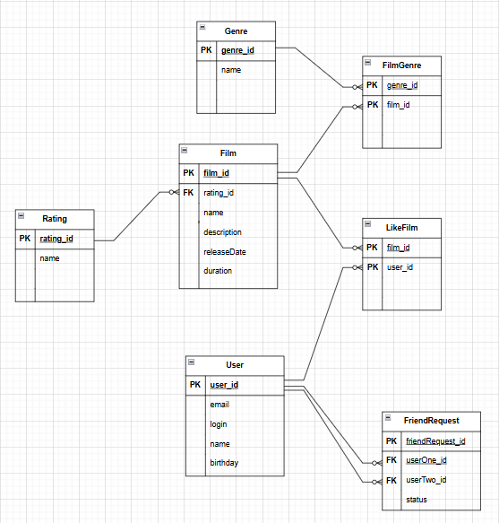

# java-filmorate

## Диаграмма базы данных filmorate

### Users

#### Вывод всех  пользователей
SELECT * FROM users;

#### Поиск пользователя по id
SELECT * FROM users WHERE id = ?;

#### Вставка пользователя
INSERT INTO users (name, email, login, birthday) VALUES (?, ?, ?, ?);

#### Обновление информации о пользователе 
UPDATE users SET name = ?, email = ?, login = ?, birthday=? WHERE id = ?;

### Film

#### Вывод всех фильмов;
SELECT * FROM film;

#### Поиск фильма по id
SELECT * FROM film WHERE id = ?;

#### Вставка фильма
INSERT INTO film(name, mpa_id, description, release_date, duration) VALUES (?,?,?,?,?);

#### Обновление информации о фильме
UPDATE film SET name = ?, description = ?, duration = ?, mpa_id=?, release_date = ? WHERE id = ?;
